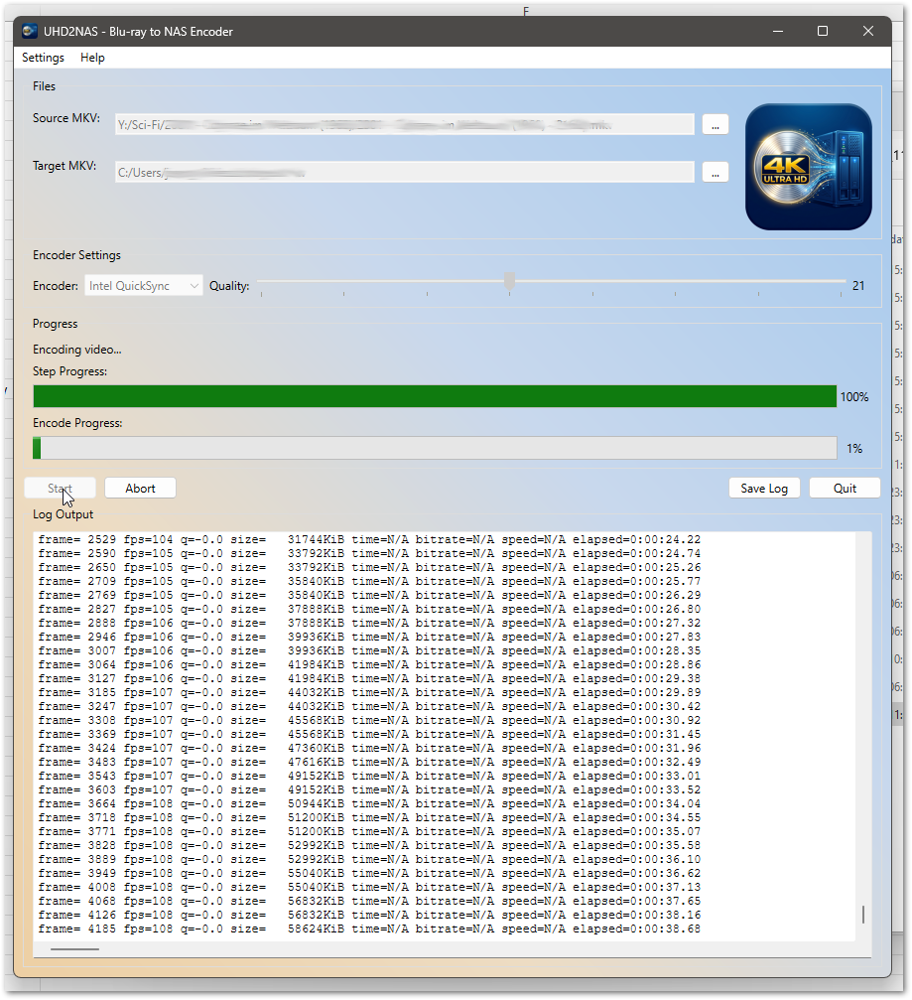

# UHD2NAS

A cross-platform Qt6 application for re-encoding Blu-ray and 4K UHD MKV files into space-efficient HEVC 10-bit files, optimized for NAS storage and streaming to media players like Kodi, Plex or Jellyfin.



## Features

- **Automatic crop detection** -- removes black bars from letterboxed content
- **Dolby Vision Profile 7 to 8.1 conversion** -- preserves Dolby Vision metadata while ensuring broad player compatibility (HDR10 fallback)
- **HDR10 metadata passthrough** -- mastering display color primaries, MaxCLL/MaxFALL are preserved
- **Zero-copy audio and subtitles** -- all audio tracks and subtitle streams are copied without re-encoding
- **Four hardware encoder backends:**

| Encoder | Backend | Typical Speed (4K) |
|---|---|---|
| Software (libx265) | CPU | ~5-10 fps |
| Intel QuickSync | Intel iGPU/dGPU | ~140 fps |
| NVIDIA NVEnc | NVIDIA GPU (RTX 20+) | ~35-80 fps |
| AMD AMF | AMD GPU (Navi+) | varies |

- **Configurable command templates** -- advanced users can modify all ffmpeg, dovi_tool and mkvmerge commands without recompiling
- **Quality slider** (CRF 15-30) with per-encoder offset for consistent file sizes across backends

## Encoding Workflows

### Full HD Blu-ray (1080p, SDR)
1. Crop detection
2. Encode to HEVC 10-bit with audio/subtitle copy

### 4K UHD Blu-ray (HDR10, no Dolby Vision)
1. Crop detection
2. Encode to HEVC 10-bit with HDR10 metadata passthrough + audio/subtitle copy

### 4K UHD Blu-ray with Dolby Vision (Profile 7)
1. Crop detection
2. Extract RPU and convert Profile 7 to 8.1 via `dovi_tool -m 2 -c`
3. Encode video-only (HEVC 10-bit)
4. Inject RPU into encoded stream
5. Final mux with original audio and subtitles via `mkvmerge`

The final mux step uses `mkvmerge` instead of `ffmpeg` because ffmpeg 8.x cannot mux raw HEVC input without timestamps.

## Requirements

- [Qt 6](https://www.qt.io/) (Widgets module)
- [ffmpeg / ffprobe](https://ffmpeg.org/download.html) with HEVC encoder support
- [dovi_tool](https://github.com/quietvoid/dovi_tool/releases) (only needed for Dolby Vision content)
- [mkvmerge](https://mkvtoolnix.download/downloads.html) (part of MKVToolNix, needed for Dolby Vision final mux)

## Building

```bash
cmake -B build -DCMAKE_PREFIX_PATH=/path/to/qt6
cmake --build build
```

On Windows with the Qt Visual Studio integration or MinGW:
```bash
cmake -B build -G "MinGW Makefiles" -DCMAKE_PREFIX_PATH=C:/Qt/6.x.x/mingw_64
cmake --build build
```

## Usage

1. Launch UHD2NAS
2. Select a source MKV file (ripped from Blu-ray via MakeMKV or similar)
3. Choose an encoder and quality setting (default: 20)
4. Click **Start**

The application auto-detects:
- Whether the source is Full HD or 4K (based on resolution)
- Whether Dolby Vision metadata is present (triggers the 5-step DV pipeline)
- Crop values for black bar removal

Tool paths for ffmpeg, ffprobe, dovi_tool and mkvmerge are configured in **Settings** and auto-detected from PATH on first launch.

## Tips

- **Quality 20** is a good default for 4K content (close to transparent)
- **Quality 22-23** works well for Full HD, since compression artifacts are less visible at 1080p
- **Hardware encoders** are 5-10x faster than software but produce slightly larger files at equivalent quality
- **Intel QuickSync** offers the best speed-to-quality ratio on systems with Intel Arc or recent integrated GPUs
- Files with spaces in the path are fully supported

## License

This project is provided as-is for personal use.
